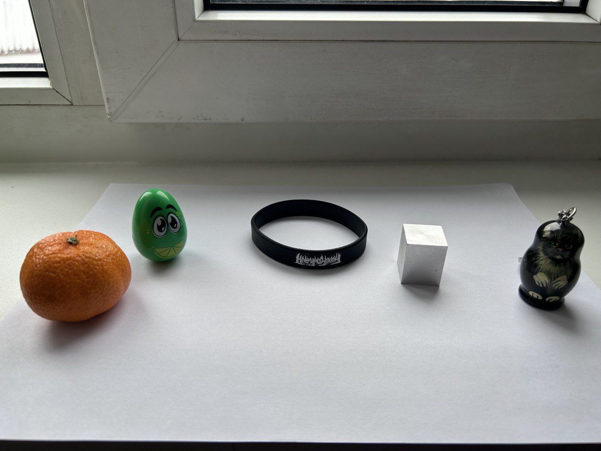

## Простейшие алгоритмы детектирования объектов на изображении

## ITMO Computer Vision Course 2022

---

# Лабораторная работа №2

## Простейшие алгоритмы детектирования объектов на изображении

**Цель работы:** 

Исследовать простейшие алгоритмы детектирования объектов на
изображении.

**Задание:** 

1. Реализовать программу согласно описанию. Можно использовать языки
   C++ или Python и любые библиотеки, при этом необходимо чтобы вся
   задача не решалась только с помощью одной встроенной функции
   (например, lib.detect_template(image, template).
2. Сравнить качество работы двух вариантов реализации по точности
   детектирования.
3. Сделать отчёт в виде readme на GitHub, там же должен быть выложен
   исходный код.

**Описание:**

Необходимо реализовать два примитивных детектора объектов на
изображении, работающих с помощью поиска эталона на входном
изображении.

1. Прямой поиск одного изображения на другом (template matching)
2. Поиск ключевых точек эталона на входном изображении (например, с
   помощью SIFT, ORB..)

Программа должна принимать на вход два изображения, эталон и то, на
котором будет производиться поиск. На выходе программа должна строить
рамку в виде четырехугольника в области, где с наибольшей вероятностью
находится искомый объект. Необходимо протестировать оба варианта
программы на разных изображениях (например, сначала в качестве эталона
использовать вырезанный фрагмент входного изображения, а затем
изображение какого-либо предмета сцены, присутствующего на входномизображении, но сфотографированного с другого ракурса или с другим
освещением), не менее 10 тестовых примеров

## Теоретическая база

Определение заданного объекта на изображении - частая задача в системах копмьютерного зрения. Современные методики основываются, как правило, на применении нейросетей и методик глубокого обучения. При выборе корректных условий обучения, такие модели могут успешно применяться для самых разнообразных ситуаций. Однако их использование, с одной стороны, требует серьезного массива корректных(!) данных для обучения системы, с другой стороны, сопряжено с нагрузкой на вычислительный модуль системы. В ряде случаев возможно применение классических методов, а именно - метода поиска одного изображения на другом(т.н. template matching) и поиска ключевых точек эталона. 

Упрощенно суть метода Template Matching можно представить таким алгоритмом:

1.  На входе имеем два изображения - одно большего размера(оригинал), другое меньшего(шаблон или темплат). 

2. "Перемещаем" шаблон по изображению(слева направо, сверху вниз, построчно) и применяем некоторое математическое преобразование над элементами массивов, представляющих изображения. Получается некое подобие 2D-свертки. В результате получаем новую матрицу. 

3. В этой матрице ищем максимум(или минимум, в зависимости от особенностей используемого математического преобразования) - это и будет являться точкой, где приблизительно находится темплат на оригинальном изображении.    

Математические преобразования используются различные, некоторые из них представлены в документации OpenCV, например, тут [OpenCV: Object Detection](https://docs.opencv.org/4.x/df/dfb/group__imgproc__object.html#gga3a7850640f1fe1f58fe91a2d7583695dab65c042ed62c9e9e095a1e7e41fe2773)

Метод неплохо проявялет себя в тех случаях, когда темплат практически не отличается от образа на реальном изображении, но эффективность значительно падает при отличии освещения, вращения и т.д. Гораздо лучше в таких ситуациях работают алгоритмы на базе поиска ключевых точек эталона. Существует ряд алгоритмов, например запатентованный Scale-Invariant Feature Transform (SIFT), свободный для коммерческого применения Oriented FAST and rotated BRIEF (ORB) и др. Вне зависимости от конкретного алгоритма, кратко суть методов заключается в поиске на базе математических преобразований т.н. признаков(features) у изображения объекта, который будет определятся, и изображения, на котором будет вестись поиск. После этого признаки сопоставляются и избираются наиболее близкие совпадения. Если количество совпадений превышает некоторый заданный порог, можно говорить о наличие искомого объекта на заданном изображении. Методы устойчивы в некоторых пределах к изменению масштаба и поворота. Некоторые методы, например, ORB можно улучшить добавлением машинного обучения. 

Библиотека OpenCV имеет реализации данных методов, что позволяет легко интегрировать их в проекты.      

## Описание разработанной системы

Для решения задачи написана программа на python - main.py -  реализует template matching и ORB feature-matching методами библиотеки OpenCV.

Для определения положения объекта через template matching используется формула SQDIFF:

 

где T - матрица изображения-темплата, I - матрица изображения, на котором производится поиск. Положение наиболее вероятного места темплата определяется координатами минимума. Причины разделения программы на два скрипта обоснованы в разделе результатов работы. 

Исходные коды программы расположены в папке src, результаты определения находятся в папке out, исходные изображения - в папке input. 

example.jpg - исходное изображение, на котором производится поиск.

temp_original.jpg - изображение искомого объекта - вырезано из изображения, на котором проводится поиск

temp_v1.jpg и т.д. - различные изображения искомого объекта. 

Скрипт разделен на три основные функции:

**template_matching_my**(src, temp) - реализация template matching без применений встроенной функции OpenCV c использованием Numpy.  

**template_matching_ocv**(src, temp) - реализация template matching на базе применения встроенной функции OpenCV.

**feature_matching_orb**(src, temp) - реализация feature matching c применением алгоритма ORB.

В ходе поиска изображения методом ORB использовался Brute-Force Matcher и расстояние Хамминга. После нахождения матчей, рамка изображалась вокруг точки с наименьшим расстоянием(т.е. предположительно лучшим положением предмета)

## Результаты работы и тестирования системы

Исходное изображние:

Искомый объект:

Результат успешного определения:

Эффективность определения темплата, вырезанного из исходного:

| Метод         | TM-Numpy | TM-OCV | FM-ORB |
| ------------- | -------- | ------ | ------ |
| Эффективность | 100%     | 100%   | 98%    |

При этом стоит отметить, что реализация на Numpy отличается значительно более низкой скоростью исполнения. Поэтому для следующих тестов она не используется. Реализация поиска на базе feature-matching в целом достигла успеха, но указала на объект чуть менее точно.

Эффективность определения изображения объекта с разным освещением, ракурсом и т.д. на основании 10 изображений

| Метод         | TM-OCV | FM-ORB |
| ------------- | ------ | ------ |
| Эффективность |        |        |

## Выводы по работе

В ходе работы были исследованы методы поиска изображений и реализовано два детектора объеков - на базе template matching и на базе feature matching с использованием алгоритма ORB. Метод template matching успешно справился с поиском изображения, минимально отличающего от оригинала, метод ORB оказался более устойчив к поворотам и изменениям масштаба. 

## Использованные источники

1. [OpenCV: Template Matching](https://docs.opencv.org/4.x/d4/dc6/tutorial_py_template_matching.html)

2. [OpenCV: Feature Matching](https://docs.opencv.org/3.4/dc/dc3/tutorial_py_matcher.html)

3. [Scale-invariant feature transform - Wikipedia](https://en.wikipedia.org/wiki/Scale-invariant_feature_transform) 

4. [Oriented FAST and rotated BRIEF - Wikipedia](https://en.wikipedia.org/wiki/Oriented_FAST_and_rotated_BRIEF)

5. [Features from accelerated segment test - Wikipedia](https://en.wikipedia.org/wiki/Features_from_accelerated_segment_test)

6. [Real Life Object Detection using OpenCV – Detecting objects in Live Video using SIFT and ORB](https://circuitdigest.com/tutorial/real-life-object-detection-using-opencv-python-detecting-objects-in-live-video)

7. [GitHub - ojimpo/python-template-matching: template matching without using OpenCV](https://github.com/ojimpo/python-template-matching)

